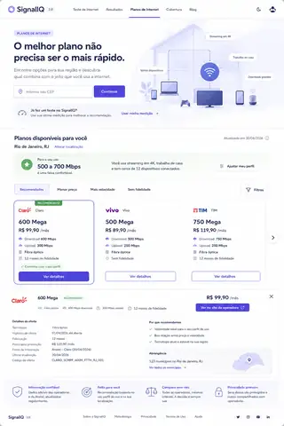

# /planos — metas visuais de layout

Estas referências foram fornecidas e aprovadas como **metas de composição/layout** para a implementação da Issue #10 do `signallq-plans`.

Elas não criam um Design System paralelo e não substituem o **Design System oficial SignallQ 2.0**, que continua sendo a autoridade para tokens, componentes, tipografia, cores, espaçamento, responsividade e estados.

## Referências

### `planos-layout-target-01.webp`

Referência principal para a experiência completa de `/planos` em uma única jornada:

- hero com entrada por CEP;
- reaproveitamento de medição SignallQ;
- apresentação da faixa recomendada;
- filtros/ordenação iniciados pelo usuário;
- ofertas ranqueadas;
- destaque de melhor compatibilidade;
- detalhe expandido da oferta;
- justificativas da recomendação;
- transparência, fonte, vigência, fidelidade e confiança.

### `planos-layout-target-02.webp`

Referência complementar para hierarquia editorial e composição mais leve:

- mensagem principal centrada em adequação, não em velocidade máxima;
- CTA primário claro;
- entrada alternativa para analisar a conexão atual;
- benefícios `Escolher / Entender / Resolver`;
- bloco de recomendação resumido;
- explicação visual simples de como a recomendação funciona.

## Como usar

A implementação da Issue #10 deve buscar o **espírito de composição, hierarquia e densidade** destas duas referências, preservando a jornada aprovada e usando apenas dados reais retornados pelo `signallq-plans`.

Quando houver divergência visual, a ordem de autoridade é:

1. Design System SignallQ 2.0 para linguagem visual e componentes;
2. jornada/protótipo aprovado de `/planos` para experiência;
3. estas imagens para meta de layout e composição.

Não copiar operadoras, preços ou dados fictícios presentes nas referências. O backend real é a fonte de verdade funcional.

> Observação: os arquivos armazenados aqui são cópias WebP otimizadas para documentação e referência visual no repositório.
